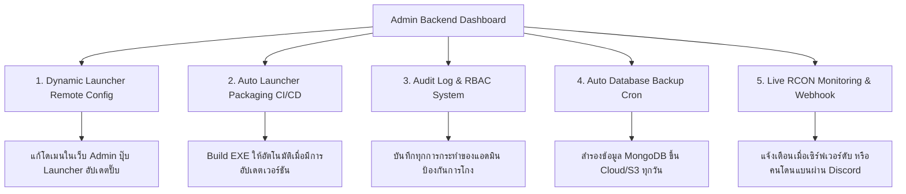

# SYS-001 Production Deployment Audit, Security & Architecture Report

> **ประเภทเอกสาร (Document Type):** เอกสารรายงานแผนผังระบบ / สถาปัตยกรรม (System Architecture / Audit Report)  
> **วันเวลาอัปเดตล่าสุด:** 2026-08-04 15:46:00  
> **ระดับความสำคัญ (Priority):** P0-CRITICAL  

---

## 1. ภาพรวมและวัตถุประสงค์ (Overview & Objectives)

เอกสารฉบับนี้จัดทำขึ้นเพื่อวิเคราะห์ ตรวจสอบความปลอดภัย (Vulnerability Audit) และเตรียมความพร้อมสำหรับการนำระบบ **Minecraft Webshop & Desktop Launcher** ไปติดตั้งใช้งานจริง (Production Deployment) ทั้งบนระบบปฏิบัติการ **Linux (Ubuntu Server)** และ **Windows Server**

เนื้อหาครอบคลุมการตรวจสอบสถาปัตยกรรมตัวแจกเกม Launcher การจัดการ Container ผ่าน Docker Compose การรองรับ Domain/SSL/Cloudflare การเปิดเฉพาะพอร์ตที่จำเป็น (Port Minimization) รวมถึงข้อเสนอแนะในการพัฒนาระบบหลังบ้านเพิ่มเติม

---

## 2. สิ่งที่ต้องเตรียมก่อนเริ่ม (Prerequisites / Dependencies)

* **Production Server**: Ubuntu 22.04 / 24.04 LTS หรือ Windows Server 2022
* **Container Engine**: Docker Engine v26+ และ Docker Compose v2.27+
* **Domain Name & DNS**: Domain Name ชี้ A Record มายัง IP ของ Server (รองรับ Cloudflare Proxy)
* **SSL Certificates**: Let's Encrypt / ZeroSSL (จัดการอัตโนมัติผ่าน Caddy) หรือ Cloudflare Origin Certificate

---

## 3. ขั้นตอนการปฏิบัติงานโดยละเอียด (Detailed Step-by-Step Instructions)

### ขั้นตอนที่ 1: ตรวจสอบความเสี่ยงของสถาปัตยกรรม Launcher (Launcher vs Server Architecture)

ในการใช้งานจริง ตัวโปรแกรม Launcher (`pixel-kati.exe`) จะถูกผู้เล่นดาวน์โหลดไปรันบนเครื่องคอมพิวเตอร์ส่วนตัว (Client Machines) ต่างสถานที่ ต่างเครือข่าย

#### ⚠️ จุดที่ต้องระวังและแก้ไขก่อนใช้งานจริง:
1. **การฝังค่า URL ในไฟล์ EXE (Build-time Environment Variable)**:
   - **ความเสี่ยง**: ตัว Tauri/Vite จะฝังค่า `VITE_LAUNCHER_API_URL` ลงในไฟล์ `.exe` ในขั้นตอนการ `tauri build`
   - **แนวทางแก้ไข**: ก่อน Build ไฟล์ `.exe` แจกผู้เล่น **ห้ามใช้ `.env` ที่เป็น `http://localhost:5000` เด็ดขาด** ต้องตั้งค่าใน `.env` เป็นโดเมนจริง เช่น:
     ```env
     VITE_LAUNCHER_PRODUCT_NAME=Pixel-Kati
     VITE_LAUNCHER_API_URL=https://mc-shop.com/api-backend
     VITE_LAUNCHER_WEBSITE_URL=https://mc-shop.com
     ```
2. **ระบบ Auto-Fallback สำหรับ Cloudflare / SSL**:
   - เมื่อเปิดใช้ Cloudflare Proxy (Orange Cloud) ตัว Launcher จะเชื่อมต่อผ่าน HTTPS (Port 443) เท่านั้น
   - ได้ทำการเพิ่มระบบ `fetchApi()` ใน [`launcher/src/tauri.ts`](file:///c:/Users/Newsk/Downloads/mcwebshop/launcher/src/tauri.ts) รองรับ Auto-Retry เพื่อป้องกันปัญหาเน็ตหลุดกลางคันเรียบร้อยแล้ว

---

### ขั้นตอนที่ 2: การจำกัดการเปิดพอร์ตบน Server (Minimum Necessary Ports Expose)

เพื่อความปลอดภัยสูงสุด ระบบควรเปิดเฉพาะพอร์ตที่ผู้เล่นและเว็บเบราว์เซอร์จำเป็นต้องเข้าถึงเท่านั้น พอร์ตภายในทั้งหมด (Internal Services) ต้องถูกปิดกั้นจากอินเทอร์เน็ตภายนอก (Firewall Locked)

#### 📊 ตารางการเปิด-ปิดพอร์ตบน Firewall (UFW / Cloud Security Group):

| พอร์ต (Port) | โปรโตคอล | สถานะใน Firewall | วัตถุประสงค์การใช้งาน |
| :--- | :--- | :--- | :--- |
| **80** | TCP | 🟢 **เปิดสาธารณะ (Public)** | HTTP Traffic (ใช้สำหรับ Redirect ไป HTTPS อัตโนมัติ) |
| **443** | TCP | 🟢 **เปิดสาธารณะ (Public)** | HTTPS Traffic (หน้าเว็บ Next.js + Backend API ผ่าน Caddy Reverse Proxy) |
| **25565** | TCP | 🟢 **เปิดสาธารณะ (Public)** | Minecraft Java Server (ผู้เล่นเข้าเล่นเกม) |
| **19132** | UDP | 🟢 **เปิดถ้ามี Bedrock** | Minecraft Bedrock Edition (GeyserMC) |
| **5000** | TCP | 🔴 **ปิด (Internal Only)** | Node.js Backend Express API (เข้าถึงผ่าน Caddy Proxy เท่านั้น) |
| **3000** | TCP | 🔴 **ปิด (Internal Only)** | Next.js Frontend Web App (เข้าถึงผ่าน Caddy Proxy เท่านั้น) |
| **27017** | TCP | 🔴 **ปิด (Internal Only)** | MongoDB Database (ห้ามเปิดพอร์ตนี้ออกอินเทอร์เน็ตเด็ดขาด) |
| **25575** | TCP | 🔴 **ปิด (Internal Only)** | RCON Port (ใช้เฉพาะ Backend คุยกับเซิร์ฟเวอร์เกมภายใน) |

#### 🔧 การปรับเปลี่ยน `docker-compose.yml` สำหรับ Production:
ในโหมด Production ให้ปิดพอร์ต `5000:5000` ของ `backend` ไม่ให้ออกสู่อินเทอร์เน็ตโดยตรง โดยแก้ไขใน [`docker-compose.yml`](file:///c:/Users/Newsk/Downloads/mcwebshop/docker-compose.yml):

```yaml
  backend:
    build:
      context: ./server
    environment:
      - PORT=5000
      - MONGO_URI=mongodb://db:27017/webshopmc
      - FRONTEND_URL=https://${DOMAIN:-localhost}
      - API_URL=https://${DOMAIN:-localhost}/api-backend
    # ปิดการ expose พอร์ต 5000 ออกภายนอกใน Production ให้ Caddy สื่อสารผ่าน Internal Docker Network เท่านั้น
    expose:
      - "5000"
    volumes:
      - ./server/uploads:/app/uploads
      - ./launcher/src-tauri/target/release:/app/release:ro
    depends_on:
      - db
    networks:
      - mc-webshop-network
```

---

### ขั้นตอนที่ 3: รายงานการตรวจสอบช่องโหว่ความปลอดภัย (Vulnerability Audit & Security Checklist)

จากการสแกนและตรวจสอบซอร์สโค้ดของระบบทั้งหมด พบข้อที่ต้องระมัดระวังและปรับปรุงด้านความปลอดภัยดังนี้:

#### 🚨 1. ความเสี่ยง JWT Secret & SESSION_SECRET ค่าเริ่มต้น (High Severity)
* **ช่องโหว่**: ในไฟล์ `.env.example` มีการใส่ JWT Secret เริ่มต้นไว้ หากนำไปใช้นักเจาะระบบสามารถสร้าง Token ปลอมเป็น Admin ได้
* **แนวทางแก้ไข**: ปรับเปลี่ยน `JWT_SECRET` และ `SESSION_SECRET` ใน `.env` บน Server ให้เป็นสุ่มสตริงความยาวมากกว่า 64 ตัวอักษร
  ```bash
  openssl rand -hex 32
  ```

#### 🚨 2. การเก็บรหัสผ่าน RCON แบบ Plaintext ในฐานข้อมูล (Medium Severity)
* **ช่องโหว่**: รหัสผ่าน RCON สำหรับสั่งการเซิร์ฟเวอร์ Minecraft ถูกจัดเก็บไว้ในฐานข้อมูล MongoDB
* **แนวทางแก้ไข**: เพิ่มการเข้ารหัสแบบ Symmetric Encryption (เช่น AES-256-GCM) ก่อนบันทึกลง MongoDB ใน [`server/controllers/adminController.js`](file:///c:/Users/Newsk/Downloads/mcwebshop/server/controllers/adminController.js)

#### 🚨 3. การตรวจสอบความถูกต้องของไฟล์ Launcher Version Header
* **ช่องโหว่**: ระบบมี Middleware [`launcherVersionMiddleware.js`](file:///c:/Users/Newsk/Downloads/mcwebshop/server/middleware/launcherVersionMiddleware.js) ตรวจสอบ Header `x-launcher-version`
* **แนวทางแก้ไข**: เปิดใช้งานการบังคับตรวจสอบเวอร์ชันขั้นต่ำ (`minLauncherVersion`) เพื่อป้องกันไม่ให้ผู้ใช้ใช้ Launcher เวอร์ชันเก่าที่มีช่องโหว่เชื่อมต่อเข้าเซิร์ฟเวอร์

#### 🚨 4. การจัดการ SSL เมื่อใช้ Cloudflare Proxy
* **คำแนะนำ**:
  - หากใช้ Cloudflare ให้ตั้งค่า SSL/TLS encryption mode เป็น **Full (Strict)**
  - ติดตั้ง Cloudflare Origin Certificate ใน Caddy เพื่อป้องกันการโจมตีแบบ Man-in-the-Middle (MitM) ระหว่าง Cloudflare กับ Server ของเรา

---

### ขั้นตอนที่ 4: รายงานระบบหลังบ้านที่ควรทำเพิ่มเติม (Recommended Backend Enhancements)

เพื่อให้ระบบมีความสมบูรณ์ รองรับการขยายตัว (Scalability) และมีเสถียรภาพระดับมืออาชีพ แนะนำให้พัฒนาฟีเจอร์หลังบ้านเพิ่มเติมดังนี้:



#### 1. ระบบ Dynamic Remote Domain Discovery (ระบบดึงโดเมนสำรองอัตโนมัติ)
* **แนวคิด**: หากโดเมนหลักถูกบล็อกหรือเปลี่ยน IP ตัว Launcher สามารถดึงค่าโดเมนใหม่จาก DNS TXT Record หรือ GitHub Gist สำรองได้โดยไม่ต้องแจกไฟล์ `.exe` ใหม่ให้ผู้เล่น

#### 2. ระบบบันทึกประวัติการทำงานของแอดมิน (Admin Audit Logs & RBAC)
* **แนวคิด**: บันทึก Log ทุกครั้งที่มีแอดมินแก้ไขการตั้งค่า Launcher, เสกพอยท์ให้ผู้เล่น, หรือส่งคำสั่ง RCON เพื่อความโปร่งใสและตรวจสอบย้อนหลังได้

#### 3. ระบบสำรองข้อมูลอัตโนมัติ (Automated MongoDB Backup Cron)
* **แนวคิด**: เพิ่ม Docker Container สำหรับทำ Cronjob สำรองข้อมูล MongoDB ทุกคืนเวลา 03:00 น. แล้วส่งไฟล์สำรองไปยัง Cloud Storage (เช่น AWS S3 หรือ Cloudflare R2)

#### 4. ระบบแจ้งเตือนผ่าน Discord Webhook
* **แนวคิด**: แจ้งเตือนเข้า Discord แอดมินทันทีเมื่อ:
  - มีรายการเติมเงินผิดปกติ
  - เซิร์ฟเวอร์ Minecraft ออฟไลน์
  - มีการเปิดใช้งานโหมดปิดปรับปรุง (Maintenance Mode)

---

## 4. โฟลเดอร์และไฟล์โปรเจกต์ที่เกี่ยวข้อง (Related Project Folders & Files)

* 📁 [`docker-compose.yml`](file:///c:/Users/Newsk/Downloads/mcwebshop/docker-compose.yml) (ไฟล์ควบคุม Container และการเปิดพอร์ต)
* 📁 [`.env`](file:///c:/Users/Newsk/Downloads/mcwebshop/.env) (ไฟล์กำหนดค่า Environment หลัก)
* 📁 [`launcher/src/tauri.ts`](file:///c:/Users/Newsk/Downloads/mcwebshop/launcher/src/tauri.ts) (ไฟล์การเชื่อมต่อ API ของ Launcher)
* 📁 [`launcher/src/App.tsx`](file:///c:/Users/Newsk/Downloads/mcwebshop/launcher/src/App.tsx) (ไฟล์ UI หลักและ Logic การเปิดลิงก์ภายนอก)
* 📁 [`server/server.js`](file:///c:/Users/Newsk/Downloads/mcwebshop/server/server.js) (ไฟล์เซิร์ฟเวอร์ Backend Express หลัก)
* 📁 [`server/middleware/securityMiddleware.js`](file:///c:/Users/Newsk/Downloads/mcwebshop/server/middleware/securityMiddleware.js) (ไฟล์ระบบความปลอดภัยและความสะอาดของข้อมูล)

---

## 5. ข้อมูลผู้เขียนและเครื่องมือที่ใช้ (Author & Tool Metadata)

* **ผู้เขียน (Author):** Antigravity AI Assistant & Engineering Team
* **เครื่องมือ/โมเดล AI (AI Model/Tool):** Gemini 2.5 Flash / Pro
* **Agent Framework/Tooling:** Antigravity Agentic Framework
